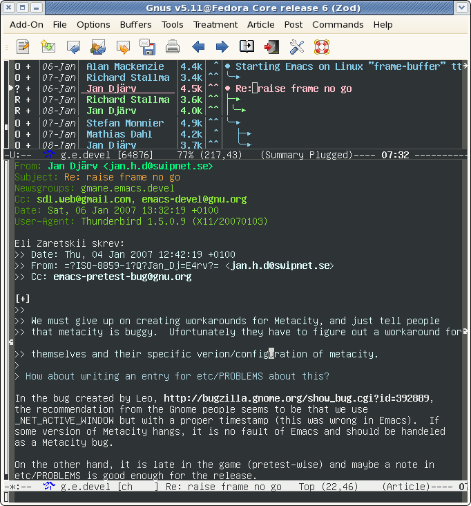
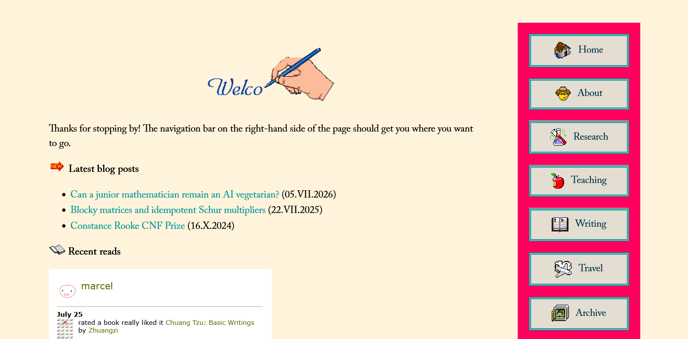

+++
date = '2026-07-26T12:24:27-04:00'
draft = true
title = 'The Promise and Perils of Technology'
+++

The internet is a powerful thing.
When Gutenberg printed his Bible in the 15th century, he could hardly have envisioned that in a few hundred years any two-bit graduate student with a computer and some free time would be able to publish his thoughts for anyone in the world to access.
The story of writing has been one of slow democratization.
What began as a record-keeping tool, to be used only by government administrators, slowly spread among the upper classes before becoming widespread during the industrial revolution.
Now, almost everyone in developed countries can write11\. Unfortunately, in some countries (particularly in sub-Saharan Africa), [many adults still cannot read and write](https://ourworldindata.org/literacy).
We are inundated today by information from all sides, and anyone anywhere can participate in the global information exchange---whether with a TikTok comment or a bestselling book.
I want to explore a little bit of the history of how we got here, and highlight a disturbing trend I see in how we use the internet, that of a growing institutionalization of the internet and technology more broadly22\. Since the internet can apparently worsen in a lot of ways, it might also interest you to read about [enshittification](https://en.wikipedia.org/wiki/Enshittification) and [Dead Internet theory](https://en.wikipedia.org/wiki/Dead_Internet_theory). Others have already written plenty on those, though.

### A Series of Tubes
The early internet was a strange place.
If you are, like me, an infant, you will have no recollection of what the online world was like 20–30 years ago; otherwise, you will have to bear with me as I attempt to reconstruct it.

<figure class="float-right">
    
    <figcaption>Surfin' the net.</figcaption>
</figure>

First, a distinction: the internet is not the same as the web.
When you read one of these posts, you see a web site being delivered to you over the internet, but it's perfectly possible to use the internet without the web (e.g., an internet messaging app) or the web without the internet (e.g., by serving a web site on your local network without connecting to the outside world).
In the early days, there was no web, and use of the internet was largely limited to government, business, and academia for email and other communications.
One of the first online social networks to gain widespread use was [Usenet](https://en.wikipedia.org/wiki/Usenet).
Users on "newsgroups" organized around various topics post "articles"33\. "Article" does not imply a formal publication, as in "news article," but could be any piece of text. and respond with their own.
Its use in this era was limited primarily to people at universities (the only ones with email addresses), but it was in ways the precursor to internet forums and social media.

The internet and World Wide Web became publicly available in the early ’90s.
Public adoption picked up quickly, and soon after came the dot-com boom, in which one could become rich by taking a decent business and adding ".com" to the end of its name.
(For instance, Mark Cuban made his fortune by selling Broadcast.com to Yahoo for $5 billion in 1999 ($10 billion in 2026 dollars). Yahoo shut the service down three years later.)

<figure>
    <image src="robotwisdom.jpg" \
    alt='An early web page titled "Robot Wisdom" featuring links to various web pages.'
    width=400>
    <figcaption>The first "weblog," published by Jorn Barger in 1997.</figcaption>
</figure>

Despite the dot-com crash, the internet, of course, became ubiquitous.
In this era of the internet—before social media—I want to pay particular emphasis to blogs and internet forums.

Blogs gave people the ability to share their ideas with the world.
What started as a way for people to document interesting places on the web eventually became a sort of diary, and in the early 2000s the "blogosphere" took shape.
Many of these early blogs were hosted on dedicated services like Blogger, which made creating a blog easy but also had the downside of homogeneity.
Many blogs looked the same, and all sites were hosted on the Blogger servers (later Google, after an acquisition).
WordPress, an open-source toolset for blog publishing, would launch later, expanding the number of options.

Early forums were perhaps the most widespread form of mass social networking before modern social media platforms.
Evolving out of Usenet and physical bulletin boards, they allowed users to engage in long, threaded conversation and were organized around a central topic—a type of car, a video game, a profession.
Two key features of these forums are that they are open and decentralized: Anyone can access and read the forum, and the forums for, say, the Toyota Corolla and the Python programming language are totally independent sites.
These aspects make forums an essentially democratic technology.
The latter, in particular, might seem a bit minor, but it is important, protecting the broader forum network from the bad decisions of any one forum's maintainers.
Of course, these forums still exist, but typically around specialized topics and with drastically reduced user counts44\. For instance, when I visit the [Python forums](https://python-forum.io/), I am the only user browsing, and there seem to be 1–2 posts per day, if that..
They have largely been supplanted by modern social media.

Mark Zuckerberg launched Facebook in 2004.
Other social media platforms existed before, but none would be as long-lasting or as impactful as Facebook.
Facebook's ability to connect people personally and directly, even if they did not necessarily know each other, was legitimately transformational.
Usenet and the early forums brought people together, but always did so in a specific context.
With Facebook, the context became universal, and, without barriers, the network could grow far wider than before.

In the decade after Facebook's launch, there was some discussion of its potential as a powerful democratic force.
In particular, during the Arab Spring, protestors used Facebook to organize collective action and to document the crimes of their oppressive governments.

### The Walls Close In
The internet today is a very different place than it was 20 or 30 years ago.
Gradually, there has been a shift from the decentralized blog- and forum-based structure of the early internet to one dominated by a few large companies.
This has happened in several distinct ways.

<figure>
    
    <figcaption>The <a href="https://marcelgoh.ca/">personal site</a> of Marcel Goh, a mathematics Ph.D. student. This kind of customization is impossible on modern platforms.</figcaption>
</figure>

Blogs, though they seem to have dormant for a while, have made a bit of a resurgence lately.
Unfortunately, many if not most modern blogs are hosted on Substack or Medium.
For one thing, these platforms make it hard or impossible to customize your blog beyond the very basic of changes.
This might seem like simply an aesthetic preference, but a site's design can tell you a lot about the person who made it, as in the figure above.
These platforms strip people of their expressive power.
Also, these platforms are closed off (Medium is particularly bad here).
Writers on Medium are beholden to its recommendation algorithm.
If Substack decides to increase the cut of your money it takes—too bad!

